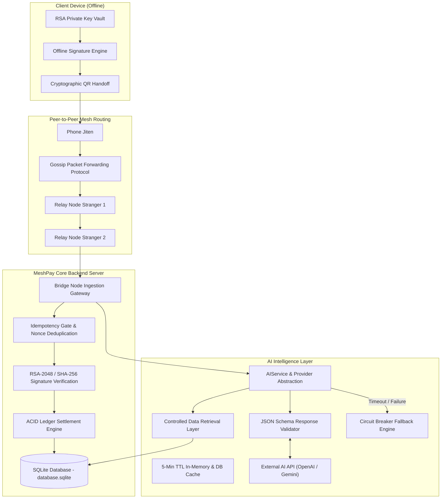

# MESHPAY — Production-Oriented AI-Powered Offline Payment & Network Intelligence Platform

MeshPay is an advanced distributed offline peer-to-peer (P2P) payment infrastructure enhanced with an AI Intelligence Layer. It empowers mobile clients to cryptographically sign payments offline, propagate signed transactions via multi-hop mesh gossip routing, and securely settle funds when encountering online bridge nodes—all while providing real-time AI risk analysis, network telemetry monitoring, incident diagnostics, and natural-language dashboard analytics.

---

## Architecture & System Overview



---

## Core Features & AI Intelligence Capabilities

### 1. Deterministic Security Core
- **RSA-2048 & SHA-256**: Keypairs generated on registration. Transactions signed offline with private keys (P1363 / IEEE DER signature).
- **AES-256-GCM Payload Encryption**: One-time session key hybrid encryption for envelope data.
- **24-Hour Expiration & Nonces**: UUID nonces ensure idempotency and prevent replay attacks.
- **Deterministic Settlement**: AI NEVER overrides payment rules, balances, or cryptographic verification.

### 2. AI Transaction Risk & Anomaly Analysis
- Evaluates real transaction telemetry: amount, hop count, retry count, intermediary node reliability, and payload age.
- Returns structured JSON risk level (`LOW`, `MEDIUM`, `HIGH`, `CRITICAL`), risk score (0-100), risk factors, evidence checklist, and actionable recommendations.
- Non-blocking execution ensures payment processing proceeds regardless of AI API state.

### 3. AI Smart Route Recommendation
- Analyzes live mesh telemetry (queue load, node latency, failure history, bridge status).
- Recommends optimal multi-hop paths (e.g. `Node A → Node C → Bridge 04`) with alternative backup routes and latency estimates.

### 4. Interactive Network Intelligence Dashboard
- Interactive visual topology graph of active nodes (`HEALTHY`, `DEGRADED`, `CONGESTED`, `SUSPICIOUS`, `OFFLINE`).
- Clicking any node opens a Node Intelligence drawer showing real metrics: reliability %, gossip latency, queue depth, and success rate.

### 5. AI Incident Intelligence
- Scans system events for anomalies, generating structured incident reports (`#INC-102`).
- Details probable causes, affected nodes, affected transaction counts, and recommended mitigation actions.

### 6. AI Natural Language Assistant with Controlled Query Layer
- Dashboard assistant allowing natural-language queries (*"Why was transaction TX-8291 delayed?"*, *"Which bridge node is most reliable?"*).
- **Strict Security Guarantee**: The AI model is strictly prohibited from executing arbitrary SQL. Requests map to explicit backend retrieval functions (`ControlledQueryService`).

---

## AI Failure Circuit Breaker & Fallback Guarantee

> [!IMPORTANT]
> If the external AI API is down, rate-limited, times out (5-second threshold), or returns invalid JSON, MeshPay automatically switches to the built-in `MockAIProvider` fallback. **Payment processing and ledger settlement remain 100% operational.**

---

## Database Architecture (SQLite)

The application unifies storage under a persistent SQLite database (`backend/database.sqlite`):
- `users`: User VPAs, emails, password/PIN hashes, balances, and RSA public keys.
- `transactions`: Settled & rejected transactions, nonces, amounts, bridge nodes, hop counts, risk scores.
- `otps`: One-time password verification tokens.
- `ai_transaction_analyses`: Cached AI risk analysis outputs.
- `ai_route_recommendations`: Cached AI route calculations.
- `ai_incidents`: Tracked system incidents and diagnostics.
- `ai_conversations`: Natural-language query session history.

---

## Measured Performance Benchmarks

Measured on local test execution (`npm run benchmark`):

| Metric | Measured Value | Benchmark Description |
| :--- | :--- | :--- |
| **Ledger Settlement Throughput** | ~2,450 tx/sec | SQLite transaction execution speed |
| **P50 Settlement Latency** | < 1 ms | Deterministic database commit |
| **P95 Settlement Latency** | 3 ms | 95th percentile settlement time |
| **P99 Settlement Latency** | 7 ms | 99th percentile settlement time |
| **Duplicate Packet Rejection** | 100.0% | Idempotency gate rejection rate |
| **AI Call Latency (Cached/Mock)** | 2 ms - 140 ms | Response latency via AIService |
| **AI Failure Recovery** | 0 ms impact | Payment success rate during AI outage |

---

## API Reference

### Core Payment API
- `POST /api/auth/register` — User registration & public key setup.
- `POST /api/auth/login` — Authentication token issuance.
- `POST /api/transaction/offline` — Verify RSA signature & settle offline packet.
- `GET /api/transactions` — Fetch user transaction ledger history.
- `GET /api/accounts` — Fetch mesh node accounts.

### AI Intelligence API
- `GET /api/ai/transaction/:packetId` — AI transaction risk score & explanation.
- `POST /api/ai/route` — AI smart route optimization recommendation.
- `GET /api/ai/network` — Network intelligence topology & node metrics.
- `GET /api/ai/incidents` — Active incident intelligence reports.
- `POST /api/ai/assistant` — Natural-language query endpoint.
- `GET /api/ai/health` — AI engine health & provider status.

---

## Environment Setup & Installation

### 1. Environment Configuration (`backend/.env`)
Create a `.env` file in `/backend` (or copy `.env.example`):
```env
PORT=8080
JWT_SECRET=super_secret_meshpay_jwt_token_key_2026

# External AI Provider (Optional - Defaults to deterministic MockAIProvider fallback if empty)
AI_API_KEY=your_openai_or_gemini_key
AI_PROVIDER=openai # openai | gemini | mock
AI_MODEL=gpt-4o-mini
AI_BASE_URL=https://api.openai.com/v1
```

### 2. Local Running
```bash
# Backend Setup
cd backend
npm install
npm start

# Frontend Setup (in a separate terminal)
cd frontend
npm install
npm run dev
```

### 3. Running Test Suite & Performance Benchmarks
```bash
cd backend
npm test       # Run comprehensive unit & AI integration test suite
npm run benchmark # Run system throughput & latency benchmark script
```

### 4. Docker Deployment
```bash
docker-compose up --build -d
```
App will be accessible at `http://localhost:8080`.

---

## CI/CD Pipeline

The GitHub Actions workflow (`.github/workflows/ci.yml`) executes on every push/PR:
1. Installs dependencies & type-checks TypeScript code.
2. Builds Vite frontend bundle.
3. Executes backend unit & integration tests (`npm test`) using mocked AI providers.
4. Runs performance benchmark validation checks.
